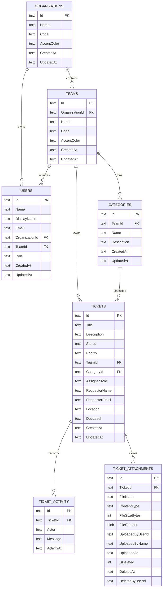

# TeamSupportPro Application Guide

## 1. Purpose and Scope

TeamSupportPro is a team-scoped support operations platform for internal service teams such as IT, Facilities, and HR. It provides:

- Ticket intake, assignment, status management, and activity tracking
- Team and directory management
- Ticket attachments and comments
- Dashboard metrics and trend visualization
- Admin reporting and export capabilities
- Optional anonymous ticket intake pages
- Session-based authentication with role-aware authorization

This document provides product, architecture, role, API, and data model coverage for operational and technical use.

## 2. High-Level Architecture

### Frontend

- React + TypeScript + Vite
- Main app shell with role-aware navigation and views
- Reports dashboard for Admin users
- Anonymous ticket page entrypoint under /anon

### Backend

- Express API server
- Session cookie auth and local auth helpers
- Role checks (Admin vs Staff)
- Team-scoped authorization for ticket operations

### Data Layer

- SQLite via better-sqlite3
- Auto-initialized schema and seed data on first run
- Foreign keys enabled
- WAL mode enabled

### Runtime Defaults

- Frontend dev server: localhost:5173
- Backend API server: localhost:3001

## 3. Functional Coverage

### Core Ticket Operations

- Create ticket
- Read team-scoped tickets
- Update team-scoped tickets
- Delete team-scoped tickets
- Add ticket comments
- Upload, download, list, and soft-delete attachments

### Directory Operations

- Organizations CRUD (Admin)
- Teams CRUD (Admin)
- Categories CRUD (Admin)
- Users CRUD (Admin)
- Directory bootstrap/read (Authenticated)

### Analytics and Reporting

- Dashboard summary metrics
- Team trend series
- Admin reporting endpoints by status, priority, assignee, and trends
- CSV and Excel export

### Settings and Controls

- Rapid identity setting toggle (Admin)
- Email notification setting toggle and connectivity tests (Admin)
- Anonymous page configuration (Admin)
- Trend seed and clear actions (Admin)
- Webhook notification configuration (Admin)

### Webhook Notifications

- Per-organization webhook endpoint registration
- Configurable event subscriptions per webhook
- Optional HMAC-SHA256 payload signing
- Enabled/disabled toggle per endpoint
- Test ping dispatch from admin UI

## 4. Authentication and Authorization

## Session and Identity

- Primary flow creates signed HTTP-only cookie session
- Local account register/login flow is available
- Test API key flow can map to a fixed Staff identity for API testing
- OIDC redirect flow exists when OIDC variables are configured

## Authorization Model

- Unauthenticated requests to protected routes return 401
- Admin-only routes return 403 if caller is not Admin
- Ticket routes enforce team scoping server-side

## Team Scoping Rules

- Authenticated users can only read and mutate tickets in their own team
- Cross-team ticket create/update/comment/delete is rejected
- Ticket attachment operations require ticket ownership in the caller team

## 5. Role Definitions

## Administrative Role

Administrative users can:

- Access all standard Staff features
- Access Reports view and export actions
- Access Settings view
- Create, update, delete organizations
- Create, update, delete teams
- Create, update, delete categories
- Create, update, delete users
- Change local account passwords for users
- Enable/disable rapid identity auth setting
- Enable/disable email notifications setting
- Run Resend and IMAP connectivity tests
- Configure anonymous intake pages
- Seed and clear dashboard trend data
- Configure per-organization outbound webhooks

Administrative users are still team-scoped for ticket operations unless explicitly using admin-only reporting endpoints.

## Staff Role

Staff users can:

- Sign in and restore session
- View dashboard and ticket queues
- Create tickets for their own team
- View and edit tickets in their own team
- Add comments to tickets in their own team
- Manage attachments on tickets in their own team
- View authenticated directory lists

Staff users cannot:

- Access Admin-only report endpoints
- Access settings endpoints
- Perform directory write operations
- Perform trend seed/clear administrative actions

## 6. Permissions Matrix

| Capability | Staff | Admin |
|---|---:|---:|
| Read own session profile | Yes | Yes |
| Read directory data | Yes | Yes |
| Create/update/delete tickets in own team | Yes | Yes |
| Comment on tickets in own team | Yes | Yes |
| Attachment CRUD in own team | Yes | Yes |
| Access reports endpoints | No | Yes |
| Export CSV/Excel reports | No | Yes |
| Directory create/update/delete | No | Yes |
| Auth and email settings management | No | Yes |
| Anonymous page settings management | No | Yes |
| Dashboard trend seed/clear operations | No | Yes |
| Webhook configuration (create/update/delete) | No | Yes |

## 7. Core User Workflows

## 7.1 Standard Staff Workflow

1. Sign in and restore session
2. Load directory and team-scoped tickets
3. Triage queue (unassigned, my tickets, team tickets)
4. Update status, priority, category, assignee, and requester details
5. Add comments and attachments during resolution
6. Resolve or close ticket

## 7.2 Administrative Workflow

1. Perform all Staff operational workflows
2. Manage organizations, teams, categories, and users
3. Configure settings for auth, email, and anonymous pages
4. Seed/clear trend data for dashboard demos
5. Run reporting and export datasets

## 7.3 Anonymous Intake Workflow

1. Public client loads anonymous page config
2. User submits ticket with scoped team/category
3. Server validates page and organization/team/category alignment
4. Ticket is created as Anonymous Request actor

## 8. API Surface Summary

## Public Endpoints

- GET /api/health
- GET /api/public/auth-settings
- GET /api/public/test-login-users
- GET /api/public/directory
- GET /api/public/anonymous-page-config
- POST /api/public/tickets

## Auth Endpoints

- GET /api/auth/me
- POST /api/auth/register
- POST /api/auth/local/login
- POST /api/auth/test-login
- POST /api/auth/logout
- GET /auth/oidc
- GET /auth/oidc/callback

## Authenticated User Endpoints

- GET /api/tickets
- GET /api/tickets/:ticketId
- POST /api/tickets
- PATCH /api/tickets/:ticketId
- DELETE /api/tickets/:ticketId
- GET /api/tickets/activity
- POST /api/tickets/:ticketId/comments
- GET /api/tickets/:ticketId/attachments
- POST /api/tickets/:ticketId/attachments
- GET /api/tickets/:ticketId/attachments/:attachmentId
- DELETE /api/tickets/:ticketId/attachments/:attachmentId
- GET /api/directory
- GET /api/organizations
- GET /api/organizations/:organizationId
- GET /api/teams
- GET /api/teams/:teamId
- GET /api/categories
- GET /api/categories/:categoryId
- GET /api/users
- GET /api/users/:userId
- GET /api/dashboard/summary
- GET /api/dashboard/trends

## Admin-Only Endpoints

- GET /api/reports/status
- GET /api/reports/priority
- GET /api/reports/assignee
- GET /api/reports/trends
- GET /api/reports/export/csv
- GET /api/reports/export/excel
- GET /api/settings/auth
- PATCH /api/settings/auth
- GET /api/settings/email
- PATCH /api/settings/email
- POST /api/settings/email/test-resend
- POST /api/settings/email/test-imap
- GET /api/settings/anonymous-pages
- PUT /api/settings/anonymous-pages
- POST /api/organizations
- PATCH /api/organizations/:organizationId
- DELETE /api/organizations/:organizationId
- POST /api/teams
- PATCH /api/teams/:teamId
- DELETE /api/teams/:teamId
- POST /api/categories
- PATCH /api/categories/:categoryId
- DELETE /api/categories/:categoryId
- POST /api/users
- PATCH /api/users/:userId
- DELETE /api/users/:userId
- POST /api/users/:userId/change-password
- POST /api/admin/dashboard/trends/seed
- POST /api/admin/dashboard/trends/clear
- GET /api/settings/webhooks
- POST /api/settings/webhooks
- PATCH /api/settings/webhooks/:id
- DELETE /api/settings/webhooks/:id
- POST /api/settings/webhooks/:id/test

## 9. Data Model

The application persists data in SQLite with foreign keys enabled.

## 9.1 Entity Relationship Diagram



## 9.2 Additional Tables

### TeamTicketTrends

- TrendDate (PK part)
- TeamId (PK part)
- TicketCount

Stores seeded and/or generated trend overlays for dashboard charts.

### AppSettings

- Key (PK)
- Value
- UpdatedAt

Stores feature and operational flags including:

- rapidIdentityEnabled
- emailNotificationsEnabled
- dashboard-trend-seed-config

### WebhookConfigs

- Id (PK)
- OrganizationId (FK → Organizations)
- Url — target HTTPS endpoint
- Secret — optional string used for HMAC-SHA256 request signing
- Events — JSON array of subscribed event names
- IsEnabled — 1 enabled / 0 disabled
- CreatedAt / UpdatedAt

## 9.3 Data Rules and Constraints

- Tickets must reference a valid Team and Category
- Category team must match ticket team at creation
- Optional assignee must belong to ticket team
- Users must reference valid Organization and Team alignment
- Role is normalized to Admin or Staff
- Attachment uploads capped at 10 MB per file
- Attachment delete is soft delete (IsDeleted flag)

## 10. Ticket Lifecycle and Activity Semantics

## Lifecycle States

- Open
- In Progress
- Pending
- Resolved
- Closed

## Priority Values

- Low
- Medium
- High
- Critical

## Activity Generation

Activity entries are written for:

- Ticket creation
- Ticket comments
- Attachment upload/removal
- Ticket field changes (status, priority, assignee, category, and selected details)

## 11. Reporting and Export Semantics

Reports aggregate ticket data by:

- Status distribution
- Priority distribution
- Assignee workload
- Created vs resolved trend over selected days

Exports provide flattened ticket rows with assignee/category/team labels in:

- CSV
- Excel (.xlsx)

## 12. Configuration and Environment Notes

Key backend configuration areas include:

- Session and cookie policy
- Allowed CORS origins
- OIDC optional provider settings
- Local admin bootstrap settings
- Fallback organization/team/role identity settings
- Email provider and IMAP settings
- SQLite database path

Key frontend-safe settings include:

- App name and API base URL
- Frontend sign-in related settings

## 13. Operational Notes

- The backend initializes schema and seeds sample data when tables are empty
- Team-scoped authorization is enforced in API, not just UI
- Admin-only actions are checked server-side
- For split hosting, cross-site cookie policy and HTTPS are required

## 14. Webhook Notifications

### Overview

Admins can register one or more webhook endpoints per organization. When tickets are created or change state, the server dispatches a JSON POST to each matching, enabled endpoint that subscribes to the relevant event. Delivery is fire-and-forget with a 5-second timeout — failures are logged but do not affect the originating request.

### Event Types

| Event | Triggered when |
|---|---|
| `ticket.created` | A new ticket is submitted |
| `ticket.updated` | Any ticket field is changed |
| `ticket.assigned` | The assignee field is set or changed |
| `ticket.resolved` | The ticket status becomes Resolved |
| `ticket.closed` | The ticket status becomes Closed |
| `feedback.submitted` | A post-resolution feedback response is submitted |

### Payload Shape

```json
{
  "event": "ticket.created",
  "occurredAt": "2025-01-01T12:00:00.000Z",
  "organizationId": "org-abc",
  "data": {
    "ticket": { ... }
  }
}
```

### HMAC Signing

When a webhook has a non-empty Secret, each delivery includes an `X-Hub-Signature-256` header of the form `sha256=<hex>`. The signature is computed as HMAC-SHA256 over the raw JSON body using the secret as the key. Receivers should verify this header before processing.

Additional delivery headers:

- `X-Webhook-Event` — the event name (e.g. `ticket.created`)
- `X-Webhook-Delivery` — a UUID unique to this delivery attempt

### Admin Configuration

Admins access webhook settings from **Settings → Webhooks**. Each endpoint record stores:

- Target URL
- Optional signing secret
- Subscribed event list
- Enabled/disabled toggle

A **Test** button dispatches an immediate test ping (a `ticket.created` event with `data.test: true`) without requiring a real ticket event.

### API Endpoints

| Method | Path | Description |
|---|---|---|
| GET | /api/settings/webhooks | List webhooks for the caller's org |
| POST | /api/settings/webhooks | Create a webhook |
| PATCH | /api/settings/webhooks/:id | Update a webhook |
| DELETE | /api/settings/webhooks/:id | Delete a webhook |
| POST | /api/settings/webhooks/:id/test | Send a test ping |

All endpoints are Admin-only.

## 15. Known Limitations and Considerations

- Some report queries aggregate globally rather than team-scoped
- Trend data can be blended from derived ticket counts and seeded overlays
- Local auth account data is persisted in a JSON file for local account workflows

## 16. Glossary

- Organization: Top-level grouping for teams
- Team: Operational support group owning tickets
- Category: Team-defined classification for tickets
- Staff: Standard operational role with team-scoped ticket permissions
- Admin: Elevated role with configuration, directory, and reporting permissions
- Anonymous Page: Public intake endpoint mapped to an organization scope
